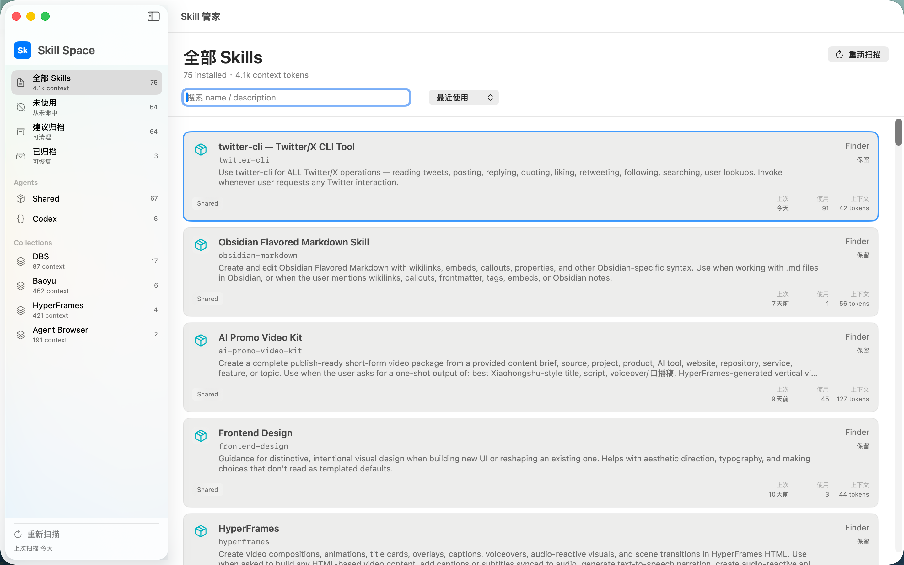

# Skill Manager

Skill Manager is a local-first macOS app for auditing, understanding, and
cleaning global agent skills.

It scans global skill folders, estimates the context cost of each skill from its
`name` and `description`, checks local session logs for usage evidence, and lets
you archive or restore unused skills.



## Why

Agent skills are easy to install and easy to forget. Over time they add context,
make agent behavior harder to predict, and become hard to review by hand. Skill
Manager gives them the same kind of local inventory view you expect from a Mac
utility: what is installed, what it does, how much context it adds, when it was
last used, and which skills are good cleanup candidates.

## Supported Global Skill Roots

- `~/.agents/skills`
- `~/.codex/skills`
- `~/.claude/skills`

Project-level skills are out of scope for the first release.

## Features

- Craft-inspired native macOS sidebar and light list layout.
- Local-only scan, with no network dependency for inventory.
- Usage evidence from Claude `Skill` tool calls and Codex tool calls that read
  `SKILL.md`.
- Evidence inspector showing matched session file, agent, match type, and time.
- Recommendation reasons for each skill, including unused, stale, protected,
  review, high-context, and recently evidenced states.
- Scan Diagnostics view for global skill roots, session roots, log counts, and
  total evidence hits.
- Sort by recent use, usage count, context tokens, or name.
- Filter by all, unused, suggested archive, archived, agent, and collection.
- Cleanup Plan view with selectable archive candidates.
- Protect important skills so cleanup suggestions and batch archive skip them.
- Mark uncertain skills for review and inspect them in a dedicated review queue.
- Detail inspector with path, usage, context cost, source, and quick actions.
- Markdown and JSON cleanup reports before batch archive, with recommendation
  reasons and evidence summaries.
- Cleanup completion summary with report and report-folder shortcuts.
- Local operation history for archive and restore actions.
- Archive and restore skills through a recoverable local archive.
- Finder reveal for active and archived skills.
- Menu bar status panel.
- GitHub Release update check.

## How To Use

1. Open the app and click **Rescan** to read the global skill folders and local
   session history.
2. Review the sidebar counts for unused skills, archive suggestions, agents, and
   skill collections.
3. Sort the list by recent use, usage count, context tokens, or name.
4. Search by skill name or description when you want to inspect a specific tool.
5. Use **Finder** to open the skill folder, or **Archive** to move a stale skill
   into the recoverable local archive.
6. Use **Protect** for skills that should never be included in cleanup, or
   **Review** for skills you want to inspect later.
7. Open **Cleanup Plan** to select the suggested cleanup set, export a report,
   and batch archive the selected skills. After cleanup, the app opens
   **History** and shows the saved report location.
8. Open **Scan Diagnostics** to verify scanned roots, session roots, log counts,
   and usage evidence coverage.
9. Open **History** to review local archive and restore operations.
10. Open **Archived** when you need to restore a skill.
11. Use **Check for Updates** to open the latest GitHub Release when a newer
   build is available.

## What The App Counts

- **Installed**: skills found under the supported global roots.
- **Context tokens**: an estimate from the skill `name` and `description`, which
  are the fields most likely to be injected into agent context.
- **Last used / usage count**: evidence from local session logs, including Claude
  `Skill` tool calls and Codex tool calls that read `SKILL.md`.
- **Evidence**: the local session file and match type behind a usage hit.
- **Recommendation reason**: the local rule that explains the current cleanup
  state.
- **Suggested archive**: skills with no recent usage evidence.
- **Collections**: grouped skill families inferred from skill names and install
  structure.

Everything runs locally. The app does not need network access to scan your
skills or session history.

## Safety Model

- **Archive is reversible**: archiving moves the skill folder into
  `~/Library/Application Support/SkillManager/Archive` and records the original
  path in a local manifest.
- **Batch cleanup exports first**: Cleanup Plan writes both Markdown and JSON
  reports into `~/Library/Application Support/SkillManager/Reports` before
  moving selected skills.
- **Protected and review skills are skipped**: local decisions live in
  `~/Library/Application Support/SkillManager/skill-decisions.json`; protected
  and review skills are excluded from Cleanup Plan.
- **Restore checks destination**: restore moves the archived folder back to its
  original path and fails if that destination already exists.
- **Operation history is local**: archive and restore attempts are recorded in
  `~/Library/Application Support/SkillManager/operation-history.json`.
- **Inventory stays local**: scanning reads the supported global skill folders
  and local session logs on this Mac.

## Install From GitHub Release

1. Download `SkillManager-v0.3.0-macos.zip` from the
   [latest release](https://github.com/Ryan-yang125/skill-manager/releases/latest).
2. Unzip it.
3. Open `SkillManager.app`.

Current release builds are ad-hoc signed. Apple Developer ID signing and
notarization are planned for a later distribution channel. If macOS blocks the
first launch, right-click the app and choose **Open**.

## Build Locally

```bash
swift test
scripts/build_app.sh
open build/SkillManager.app
```

The app bundle is created at:

```text
build/SkillManager.app
```

## Development

```bash
swift run SkillManagerScan
swift run SkillManagerScan --json
script/build_and_run.sh --verify
```

Regenerate the app icon:

```bash
swift scripts/generate_app_icon.swift
```

The Codex desktop Run action is wired through:

```text
.codex/environments/environment.toml
```

## License

MIT
