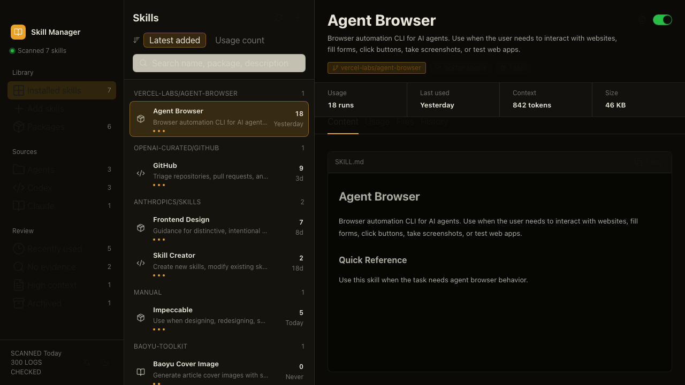

# Skill Manager

[简体中文](README.zh-CN.md)

**Evidence-backed inventory and safe cleanup for Agent Skills.**

[](https://github.com/Ryan-yang125/skill-manager/actions/workflows/ci.yml)
[](https://github.com/Ryan-yang125/skill-manager/actions/workflows/codeql.yml)
[](https://github.com/Ryan-yang125/skill-manager/releases/latest)
[](https://skills.sh/Ryan-yang125/skill-manager/audit-agent-skills)
[](LICENSE)

Skill Manager scans the Agent Skills installed on your machine, shows where each one came from, estimates its catalog context cost, finds local Codex and Claude usage evidence, and keeps archive operations reversible.

[Website](https://ryan-yang125.github.io/skill-manager/) · [Latest release](https://github.com/Ryan-yang125/skill-manager/releases/latest) · [Guides](https://ryan-yang125.github.io/skill-manager/guides/)



## Run an audit

Run the CLI directly from GitHub:

```bash
npx github:Ryan-yang125/skill-manager audit
```

Generate machine-readable output for an agent or script:

```bash
npx github:Ryan-yang125/skill-manager audit --json
```

The audit is read-only. It reports detected roots, evidence coverage, active and archived skills, source metadata, context estimates, last-seen evidence, and review candidates.

## Install the Agent Skill

Install `audit-agent-skills` with the open Skills CLI:

```bash
npx skills add Ryan-yang125/skill-manager --skill audit-agent-skills -g -y
```

Then ask your agent:

> Audit my local Agent Skills and explain the evidence before suggesting cleanup.

The Skill runs the JSON audit, explains coverage and uncertainty, asks for explicit confirmation before a write, and verifies the inventory after archive or restore.

## CLI commands

```text
skill-manager audit [--json | --markdown]
skill-manager inspect <skill>
skill-manager archive <skill> --dry-run
skill-manager archive <skill> --yes
skill-manager restore <archive-id> --yes
```

Archive writes a durable ledger before moving a skill folder. Restore preserves the original path and refuses path conflicts.

## Desktop app

Download the current desktop package from [GitHub Releases](https://github.com/Ryan-yang125/skill-manager/releases/latest).

Supported packages:

- macOS Apple Silicon: dmg and zip
- Windows x64: NSIS installer
- Linux x64: AppImage and deb

The desktop app adds a three-pane library, rendered `SKILL.md` content, package grouping, file previews, local evidence views, archive history, English and Chinese UI, and Mosaic light and dark themes.

## Supported roots

- `~/.agents/skills`
- `~/.codex/skills`
- `~/.claude/skills`

Project-level roots and additional hosts are tracked through the public [compatibility guides](https://ryan-yang125.github.io/skill-manager/guides/codex-skills-locations/).

## Evidence semantics

Skill Manager reports what the configured local scan can support:

- `observed`: matching local session evidence was found.
- `no_evidence`: the scan completed without a matching event.
- `unknown`: coverage or parsing limits prevent a confident result.

A cleanup recommendation always includes its evidence and coverage. Rare, critical, or manually installed skills remain review decisions for the user.

## Privacy

Inventory, evidence analysis, archive, restore, and report export run locally. The app and CLI send no telemetry. Update checks and user-opened HTTPS source links are the documented network surfaces.

See [docs/privacy.md](docs/privacy.md) and [SECURITY.md](SECURITY.md).

## Development

```bash
pnpm install --frozen-lockfile
pnpm lint
pnpm test
pnpm build
```

Run the CLI locally:

```bash
pnpm cli -- audit
```

Run the desktop app:

```bash
pnpm dev
```

Release gates:

```bash
pnpm release:local
```

## Contributing

Host adapters, anonymized evidence fixtures, accessibility improvements, translations, and focused bug fixes are welcome. Read [CONTRIBUTING.md](CONTRIBUTING.md) before opening a pull request.

## License

MIT
