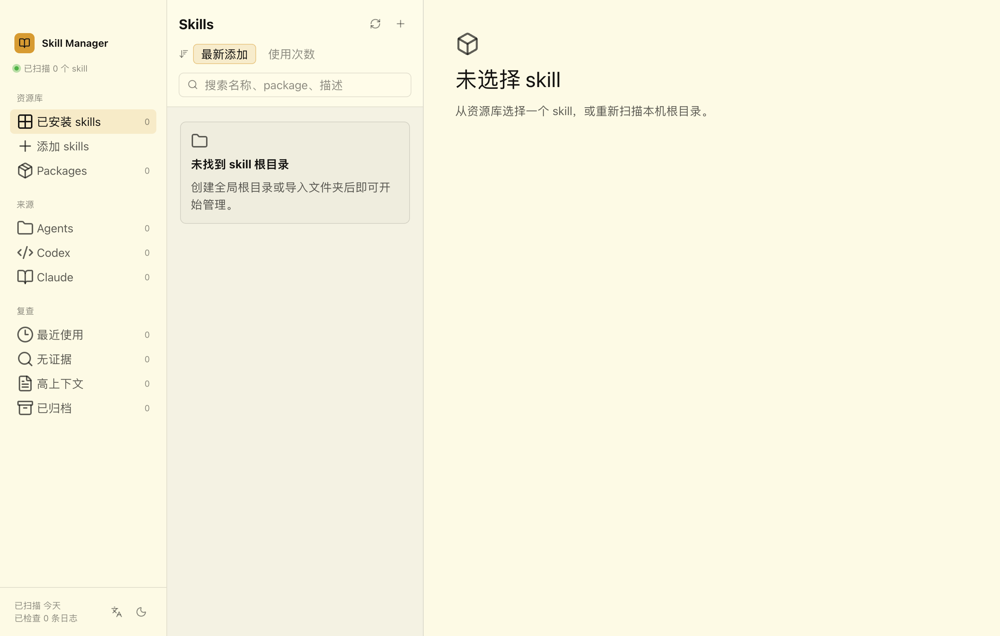

# Skill Manager

Skill Manager is a local-first desktop app for browsing, understanding, and managing agent skills installed on your machine.

It scans global skill folders, renders each `SKILL.md`, groups skills by package/source, estimates context cost, finds local usage evidence, and gives you safe archive and restore workflows.



## Supported Platforms

- macOS
- Windows
- Linux

## Supported Skill Roots

- `~/.agents/skills`
- `~/.codex/skills`
- `~/.claude/skills`

Project-level skill folders are outside the current release scope.

## Features

- Installed skill library with sidebar filters.
- Package grouping from `~/.agents/.skill-lock.json` plus local fallback grouping.
- Search by name, package, description, source, and path.
- Sort by latest added or usage count.
- Rendered Markdown content view with frontmatter hidden.
- Files tab with a compact file tree and preview.
- Usage count, last used time, and local evidence from Codex and Claude session logs.
- Archived Codex session coverage when local archived sessions exist.
- Safe archive and restore with a durable local ledger.
- Markdown and JSON cleanup reports.
- English and Chinese UI.
- Light and dark Mosaic themes.
- Local-only inventory, archive, restore, and report export.

## Install

Download the latest release for your platform from:

https://github.com/Ryan-yang125/skill-manager/releases/latest

Release files:

- macOS Apple Silicon: `SkillManager-0.5.0-arm64.dmg`
- macOS zip: `SkillManager-0.5.0-mac-arm64.zip`
- Windows: `SkillManager-0.5.0-x64.exe`
- Linux AppImage: `SkillManager-0.5.0-x64.AppImage`
- Linux deb: `SkillManager-0.5.0-x64.deb`
- Checksums: `SHA256SUMS.txt`

Verify a download:

```bash
shasum -a 256 SkillManager-0.5.0-arm64.dmg
grep SkillManager-0.5.0-arm64.dmg SHA256SUMS.txt
```

macOS direct-download builds use ad-hoc signing. If Gatekeeper blocks first launch, right-click the app and choose Open.

Windows direct-download builds may show a SmartScreen prompt until code signing is configured. Verify `SHA256SUMS.txt` before launching.

Linux users can run the AppImage or install the deb package.

## Build Locally

```bash
pnpm install
pnpm lint
pnpm test
pnpm build
pnpm package
```

The packaged output is written to:

```text
dist-electron/
```

## Development

Run the renderer only:

```bash
pnpm frontend
```

Run the desktop app:

```bash
pnpm dev
```

Run release gates:

```bash
pnpm release:local
```

## Safety Model

- Skill scans read only the supported local roots and local session logs.
- Archive writes a ledger before moving a skill folder.
- Restore refuses to overwrite an existing original path.
- Reports are written to the app data directory.
- The renderer cannot access Node APIs directly.
- Filesystem operations run through typed IPC in the Electron main process.
- External links are limited to HTTPS package URLs.

## Local Data

Skill Manager stores app data under the platform-specific Electron `userData` directory.

Typical files:

- `archive-ledger.json`
- `skill-decisions.json`
- `cleanup-reports/`

See [docs/privacy.md](docs/privacy.md) for the privacy model.

## Documentation

- [Product context](PRODUCT.md)
- [Design system](DESIGN.md)
- [Architecture](docs/architecture.md)
- [Testing](docs/testing.md)
- [Troubleshooting](docs/troubleshooting.md)
- [Release runbook](docs/release-runbook.md)
- [Security policy](SECURITY.md)

## License

MIT
